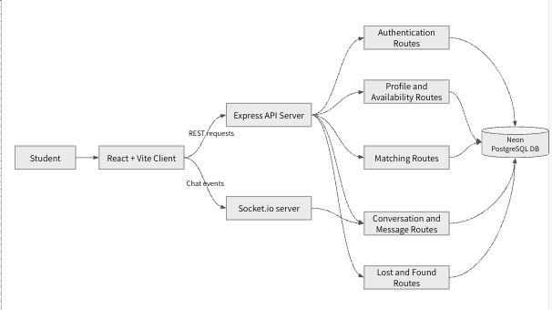
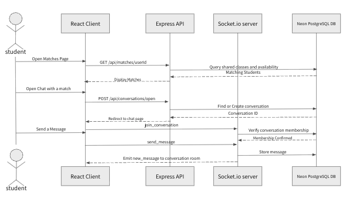

# StudySearcher

StudySearcher is a platform made by students, for students. It helps students find study partners based on shared classes and availability, then chat to coordinate study sessions.

## Stack

- React and Vite
- Node.js and Express
- PostgreSQL hosted on Neon
- Socket.IO WebSockets for real-time chat
- bcrypt for password hashing

## Architecture Diagrams

### System Component Diagram



The client sends REST requests to the Express API server for authentication, profiles, availability, matching, conversations, messages, and lost-and-found posts. Socket.IO handles chat events. The Express routes and Socket.IO server both use the Neon PostgreSQL database for persistent data.

### Study Partner Chat Sequence Diagram


 " 
When a student opens the matches page, the client requests users with shared classes and optionally overlapping availability. Opening a match creates or reuses a conversation. The chat page joins a Socket.IO room after the server verifies membership. New messages are stored in PostgreSQL and broadcast to the conversation room.

## Setup Tutorial

### Initial Setup (First Time)

```bash
git clone https://github.com/joshzaragoza/StudySearcher-
cd StudySearcher-
npm install
cd client
npm install
cd ..
```

Create a `.env` file in the project root and add the Neon database environment variables shared by the team:

```env
// Sample env file
PGHOST=
PGDATABASE=
PGUSER=
PGPASSWORD=
PGSSLMODE=
PGCHANNELBINDING=
```

### General Setup

Pull the latest changes:

```bash
git pull
```

From the project root, open two terminals:

```bash
npm run server
```

```bash
npm run client
```

Restart `npm run server` after making server-side changes.

## Neon Database

The project database schema is documented in [`db/schema.sql`](db/schema.sql).

1. Go to [Neon Console](https://console.neon.tech/).
2. Open the `StudySearcher` project and verify that you are using the correct branch.
3. Use **SQL Editor** and click **+** to run SQL queries.
4. Use the **Tables** tab to view tables or manually add, delete, and update records.
